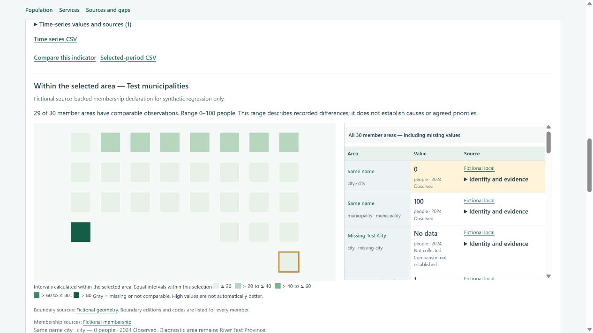
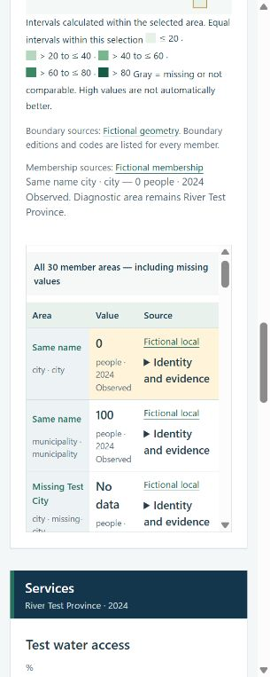

# 0.4 世界・地域診断の検証

検証日：2026-09-13。実行パッケージ0.4.0／データschema 0.2／Windows／Node.js v24.11.1／Codex In-app Browser。起点は`04b4432e06011aa99a2f690d0552e43c54252cbb`。今回検証したコード・データのSHA-256を[manifest](evidence/analysis-v0.4-manifest.json)へ保存した。対象commitとCIは末尾のリリース記録を参照。

## 採用した操作

市を選択していても、**同じ所属先の上位地域をドロップダウンから選び直したら、市を解除して上位全体を優先する**。所属表示は選択対象を意味しないため、無効な「Belongs to …」表示と、選択可能な「Whole …」のoptionを分ける。同じoptionの再選択ではchangeが起きない問題を避ける。指標・年は保持し、親の観測値がなければ親自身の欠測を示す。

上部の位置図・地域選択を維持した。世界の位置図はナビゲーション階層の直下を示し、下部比較の構成地域とは別に扱う。選択直後から、選択地域全体の各分野の値・履歴・説明が読める。追加のズームや子の選択を要しない。

各指標の下部へ、選択地域内の比較地図と全件表を追加した。PCでは横並び、狭幅では縦並び。クリックやキーボード操作は値の確認・強調に使い、分析対象を変更しない。欠測・図形未取得の地域も全件表に残る。市・基礎自治体または明示した終了地点より下の内部比較は表示しない。

世界・大陸・任意の広域は探索・分析の範囲であり、法定の計画主体と同一視しない。国内の階層名・段数・比較構成は国別台帳と任意の`dataset.analysis`による。既存の計画制度・国勢調査の方法と20か国調査を保持し、世界の入口から使う場合の適用範囲を追記した。

## 実データと接続範囲

[世界収集器](WORLD_ADAPTER.md)を実行し、UN M49の248国・地域、広域27件と世界の計276地域を収録した。World Bankの人口・平均寿命・電力アクセス・インターネットの4指標で3,544件の公表値を取得した。要求期間は2021–2026、実際の公表期間は指標により2024または2025まで。未公表年を埋めない。

中米・カリブはUN M49の013＋029を明示的に組み合わせる。今回はメキシコを含む36国・地域。World Bankの別の地域集計を流用しない。世界以外の広域全体について、今回の収集器は独自集計値を作らず欠測を残す。率の単純平均や全国値の地方配分を行わない。

参照図形は国169件、広域25件。国・地域79件は図形未結合であり、名称だけで別の図形を割り当てない。参照図形の版と、照合未完了の統計境界版を区別する。原本のSHAを照合したオフライン再生成は実取得データとバイト単位で一致した。

国別サイトへの接続は、明示した`country_sites`と`indicator_map`で行う。対応表のない指標は同じIDがあっても自動対応させず、移行元の指標IDと未対応の説明を残す。年はそのまま渡す。合成国で世界版の1,000人と国内版の100人・別定義を区別し、国診断への移動と戻る操作を検証した。**実世界データに20か国分の国内アダプターが実装・接続済みという意味ではない。**

## 検証結果

| 対象 | 結果 |
|---|---|
| `npm run check` | 35 JavaScriptモジュールとJSONの構文検証、成功 |
| `npm test` | 114件成功、失敗・skip 0 |
| データ検証 | 合成世界・旧schema 0.2・実世界・オフライン再現の4データ、エラー0 |
| 上位再選択 | 市→同じProvince／Regionで下位選択解除、親自身の欠測へ即時切替。人口2024および水2023で指標・年保持を実操作で確認 |
| 選択復元 | 再読込、戻る・進む、国版への接続で地域・期間を復元。未対応指標の説明も再読込後に保持 |
| 内部比較 | 合成30地域×2指標。0・同名の市と自治体・欠測・図形なしを全件に残す。下部クリック後も親の見出し・URLを保持 |
| 世界実画面 | 世界→米州→中米・カリブ→ドミニカ共和国を操作。各段階で全体診断を即表示。DOMの2024年4指標と2025年の欠測を確認 |
| 画面 | PC幅と375／320pxで配置を確認。最終コードでも1280px・320pxの画面を確認。確認対象の横はみ出しなし。取得したブラウザーログの警告・エラー0 |
| 実ダウンロード | 合成RiverのMarkdown・HTML・CSVの3ファイルが、現在の選択地域・期間から生成した内容とバイト単位で一致 |
| PDF印刷 | 独立した診断HTMLを専用Chromeで15ページへ印刷。全15ページを目視し、30地域×2指標の60行、凡例2組、出典、0と欠測を確認。文字欠け・重なり・行途中切断なし |
| 比較条件 | 定義ID・母集団・単位・方法・明示された観測境界版・情報源の取得状態を共通処理で判定。意味の異なる元の値は表・出力に残し、比較着色・履歴線から除外 |
| 旧データ | 任意analysisのない旧0.2データを再生成し、国別画面と既存出力・選択の回帰試験を通過。従来の統計CSV先頭18列を維持し、拡張が必要なデータだけ末尾に意味・比較条件を追加 |

[ブラウザー記録](evidence/analysis-v0.4-browser.json)・[ダウンロード照合](evidence/analysis-v0.4-downloads.json)・[PDF検証](evidence/analysis-v0.4-print.json)を保存した。PDFは合成例の印刷検証用であり、国の正式な文書様式ではない。

## 限界と未実施

実機スマートフォン、支援技術全般、200%文字拡大、自治体職員の実利用、国別の正式Word/PDF様式は未検証。PDF検証は独立した診断HTMLに対して実施し、ダッシュボード画面自体の印刷と他の印刷エンジンは未検証。世界全件248地域を含むPDFの全ページ目視は未実施。

共通UX v1.0の最終受入とは区別する。今回はPrivateテンプレートへのコード・仕様・検証記録の保存であり、新たなHosting／Public公開、DDPT本体・ウガンダ本番サイトへの適用は含まない。

## リリース記録

- 実装・仕様・検証：[`360bf3dc4bf321940bdcf6a1674f6b2d046ac734`](https://github.com/mnakagaw/DDPT-World-Template/commit/360bf3dc4bf321940bdcf6a1674f6b2d046ac734)。
- [Validate template / 34752900708](https://github.com/mnakagaw/DDPT-World-Template/actions/runs/34752900708)：成功。Windows／Ubuntu × Node 22／24の4ジョブで構文検証と114テストが成功した。
- GitHub APIでPrivateを確認し、`main`へpushした。本CIの権限は`contents: read`で、サイト公開・外部データ更新の処理は含まない。
- この末尾とcommit-bound manifestの追記はリリース記録の保存であり、上記で検証した実装コードを変更しない。

## 2026-09-26 クウェート国別候補の追加確認

この節は上記の参照実装0.4検証とは別の、未公開クウェート候補の**制作者による部分検証**。対象データSHA-256は `df69c3b86e9758add45ed0269fb2a53107447ecc45540cb830b62618ff454ab6`、環境はWindows/PowerShell・Node 24・Python 3・Codexブラウザー。公式8表の取込で165地域・17地方指標・921観測を作成し、`validate-country`はエラー0／現行計画資料未取得の警告1、buildと15ケースの実出力照合が成功した。`npm run check`は143モジュール／テンプレート、`npm test`は218件成功。これは上記の旧版35／114件の実績を新データへ流用した数ではない。

実画面では全国→Capital県→DASMAN地区→同県全域の再選択で **4,385,717→574,839→1,942→574,839** を確認した。Capital内33地区の比較全行、地域未記載4,578人の独立表示、境界未結合時の代替表示、比較行への注目後も選択対象が変わらないこと、計画資料0件時の未承認出力を確認した。15ケースのCSVと印刷用HTMLに対象地域、年、値、出典、初行・末行・全構成行が存在することを照合した。算出失業率の下部比較表・CSV来歴が「出典公表値」となる不整合を修正し、再照合した。

42受入シナリオの全件実行、印刷PDFの全ページ目視、狭幅表示、現地様式、公式コード・境界、実際の計画資料、独立監査`ACCEPT`、Hosting/Publicは未実施。詳細は[クウェート制作者確認票](evidence/kuwait-country-lesson-audit-2026-09-26.md)に記録した。

## 2026-09-26 ジョージア国別候補の追加確認

これは参照実装0.4の旧合格実績と別の、未公開ジョージア候補の**制作者による部分検証**。対象データSHA-256は `bf90082d191dabcfea1bab75bbde0e79a86e7a4f01570426e79ced16cb18b454`、環境はWindows/PowerShell・Node 24・Python 3・Codex in-app browser。Geostat 2024年確報の5表から85地域・22地方指標・1,740観測を接続し、48原本の数値セル85,449件を機械的に棚卸しした。43表の意味監査は未了であり、セル数を採用値件数としない。

`validate-country`はエラー0／計画資料未取得の警告1、buildと13ケースの実出力照合が成功した。`npm run check`は144 JavaScriptモジュールとJSONテンプレート、`npm test`は218/218件成功。画面では全国→Adjara→Batumi→Adjara全体とTbilisi→Gldaniを確認し、上位再選択、Batumiの実ゼロ、Gldaniで未提供の年齢・労働値の欠測、資料0件の未取得表示、比較内でSamgoriに注目してもGldaniの分析対象を維持する動作を確認した。全員が使える画面、幅別表示、計画資料の実内容、42受入シナリオ全件、印刷PDF、独立`ACCEPT`、Hosting/Publicは未実施。詳細は[ジョージア制作者確認票](evidence/georgia-country-lesson-audit-2026-09-26.md)に記録した。
